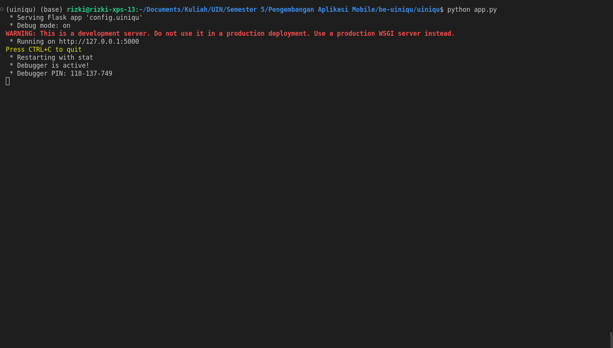

# uiniqu_flask

## Library pada Py

    aniso8601==9.0.1
    cassandra-driver==3.25.0
    click==8.1.3
    Flask==2.2.2
    Flask-Cors==3.0.10
    Flask-CQLAlchemy==2.0.0
    Flask-RESTful==0.3.9
    geomet==0.2.1.post1
    importlib-metadata==5.2.0
    itsdangerous==2.1.2
    Jinja2==3.1.2
    MarkupSafe==2.1.1
    PyJWT==2.6.0
    pytz==2022.7
    six==1.16.0
    Werkzeug==2.2.2
    zipp==3.11.0

## Setup

    - Pull container cassandra pada docker
    - Run & Exec, lalu buat keyspace 'uiniqu'
    - Buka direktori dan clone repository ini
    - Buka basis direktori dan run environment python sesuai sistem operasi
    - Install library yang diperlukan
    - Run "python app.py"

# Success

### Link Video Youtube : https://youtu.be/GI09Y8RyKYE
